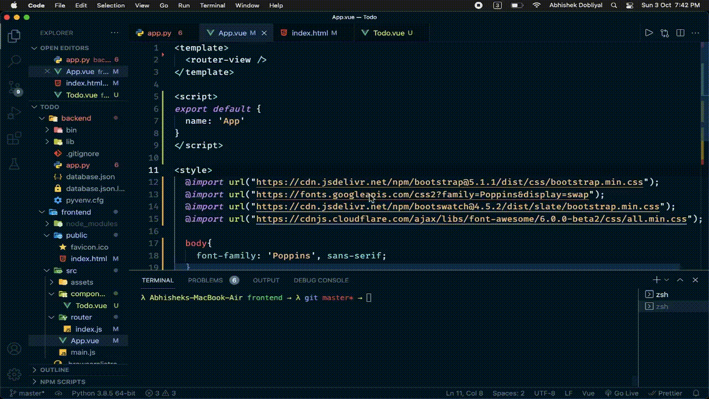

# To-Do

Get it done now or never...

## Installation and Dependencies

1. [Python](https://www.python.org)
2. [NodeJS](https://nodejs.org/en/)

## Frontend

### Project setup
```
npm install vue
```

### Compiles and hot-reloads for development
```
npm run serve
```

### Compiles and minifies for production
```
npm run build
```

### Lints and fixes files
```
npm run lint
```

### Customize configuration
See [Configuration Reference](https://cli.vuejs.org/config/).

## Backend

### Run server
```
python app.py
```


